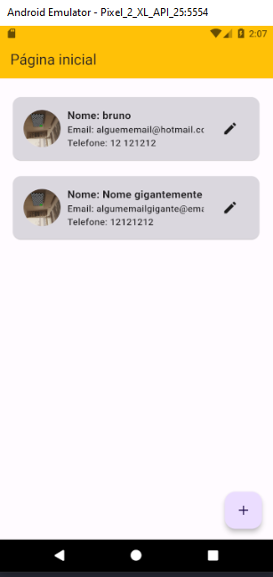
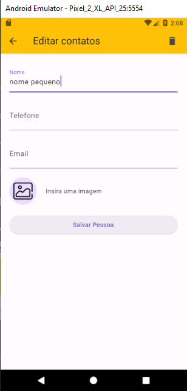
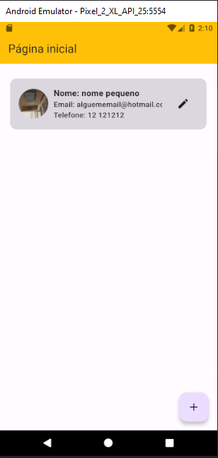

# contact_list

Aplicativo extremamente simples para a plataforma da Dio onde o usuario pode adicionar, remover e editar contatos.

- Ferramentas
  - sqflite
  - flutter
  - dart

## Checklist do Desafio

- [x] Criar um banco de dados
- [x] Fazer um cadastro de pessoa com foto de perfil​
- [x] Salvar apenas o path da imagem na base de dados​
- [x] Listar as pessoas em uma lista com sua respectiva foto​
- [x] Usar os outros componentes aprendidos

## Imagem do app finalizado

- Exemplo de contatos listados

- Exemplo ao editar contatos

- Exemplo logo depois de editar e excluir

